# Recall Architecture

Recall is a local memory system for coding agents.

It does 4 core things:

1. collect repo facts and user corrections
2. store them as memories in SQLite
3. compile the best memories into a small context pack
4. expose that pack to tools like Claude/Codex through MCP, exports, or the local daemon

## High-Level System

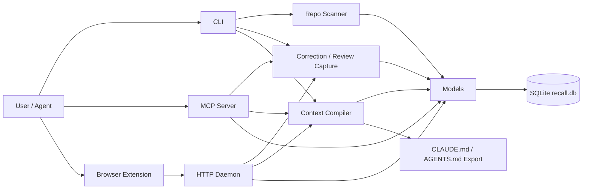

## Main Data Model

Recall stores a few related layers:

- `memories`: rules, commands, gotchas, decisions, review patterns
- `feedback_events`: whether injected memories were followed, overridden, ignored, contradicted
- `implicit_signals`: test/file/task quality signals
- `activity_events`: session/query/call history
- `eval_sessions`: aggregate effectiveness metrics
- `audit_trail`: mutation history
- `contradictions`: detected conflicts
- `policy_rules` / `approval_requests`: org governance

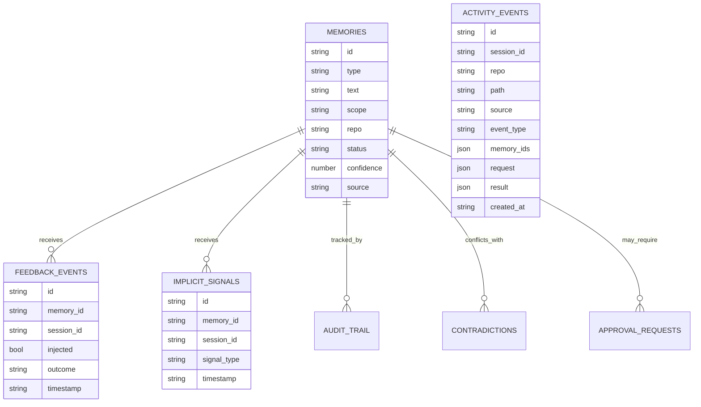

## Memory Lifecycle

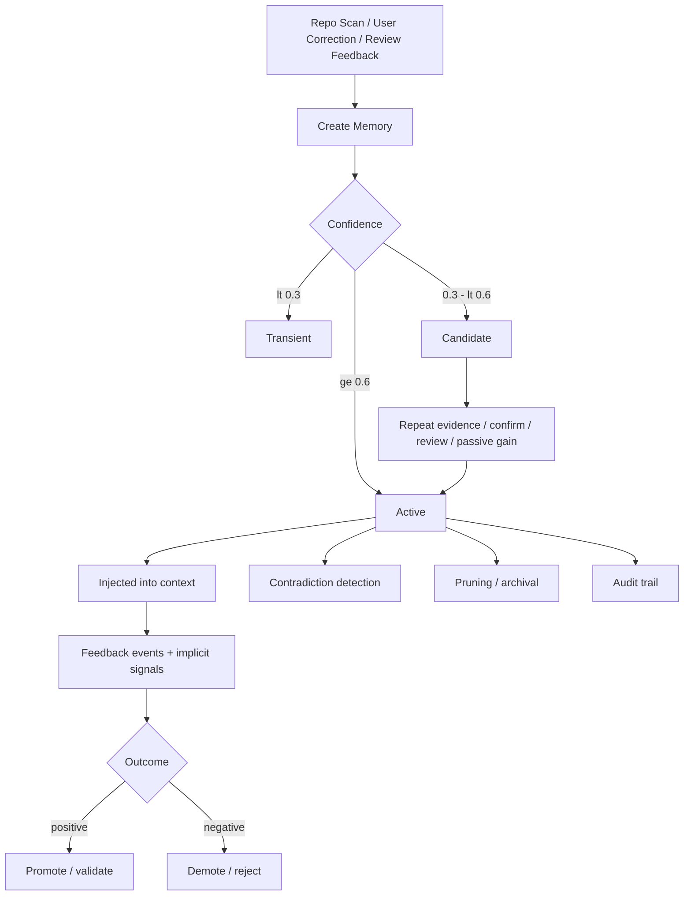

## Capture Flow

User feedback enters through CLI, daemon, or MCP.

Examples:

- `don't use npm, use pnpm`
- `review said use error boundaries`

The capture layer:

1. parses the text into one or more structured corrections
2. infers scope: path / repo / team
3. checks for duplicates
4. applies repo-quality-aware thresholds
5. creates or promotes memories

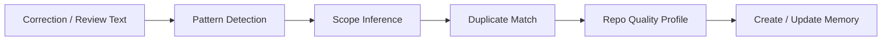

## Scan Flow

Repo scan reads:

- `package.json`
- lockfiles
- Makefiles
- CI config
- instruction files like `AGENTS.md`
- README setup commands
- Python project files

Trusted scan facts now bootstrap better than before:

- operational config-based commands can start active on cold repos
- softer scan facts stay candidate or get dropped if they look generic
- repeated scans dedupe and upgrade stale scan-created memories
- maintenance re-checks older scan-created memories and self-heals noisy rows

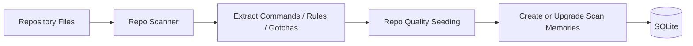

## Compile Flow

Compilation is what actually turns stored memories into injected context.

Steps:

1. load active memories for repo
2. filter by path scope
3. apply dynamic confidence threshold from repo quality
4. sort by type + confidence
5. fit into token/line budgets
6. render pack

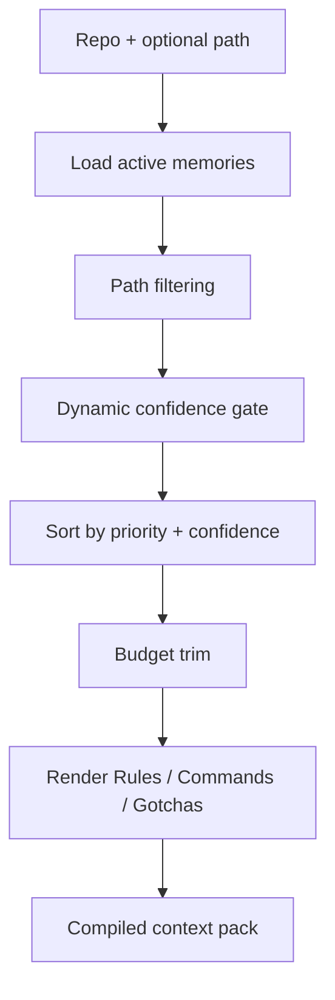

## Repo Quality / Maturity

Repo quality affects how strict Recall is.

Signals used:

- active memory count
- average health
- override rate
- contradiction rate

Outputs:

- repeat sessions required before promotion
- compile confidence threshold
- dedup similarity threshold

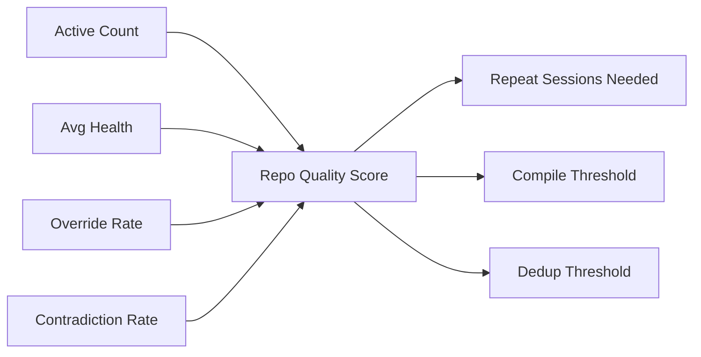

## How It Reaches Claude / Codex

There are 3 integration paths.

### 1. MCP Query Path

This is the most direct path for coding agents.

Agent asks Recall:

- `query`
- `report_correction`
- `report_review`
- `feedback`
- `activity`
- `sessions`

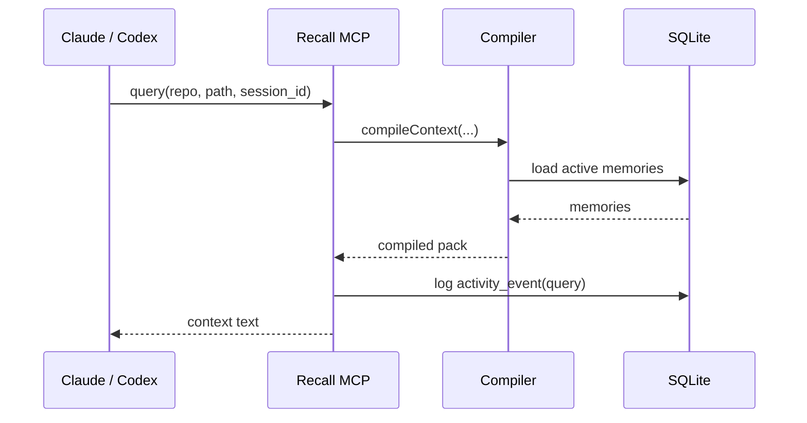

### 2. Exported Instruction Files

These are optional exports/fallbacks. Primary live integration should use MCP.

Recall can generate instruction files or repo-local context artifacts for tools that read repo-local docs:

- `CLAUDE.md`
- `AGENTS.md`
- `.recall/context.md`
- plain Markdown

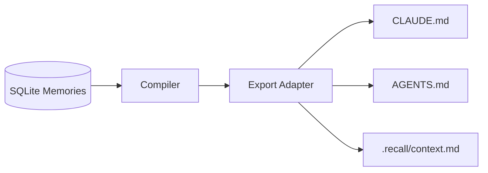

### 3. Local Daemon / Browser Hook

The daemon exposes HTTP endpoints like:

- `/compile`
- `/correct`
- `/review`
- `/activity`
- `/sessions`

The browser extension can ask the daemon for compiled memories and report corrections.

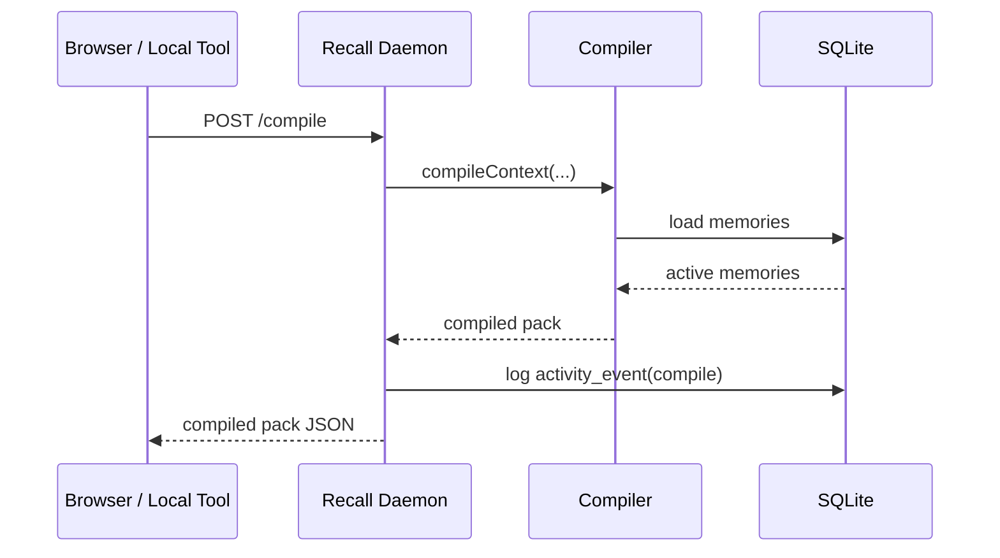

## Session / Activity Tracking

Recall now logs activity events so you can inspect what happened days later.

Each event can record:

- `session_id`
- repo
- source: `cli`, `daemon`, `mcp`
- event type: `compile`, `query`, `scan`, `correction`, `review`, `feedback`, `signal`
- affected memory ids
- request payload
- result payload

You can view it with:

```bash
recall activity -n 20
recall sessions -n 20
```

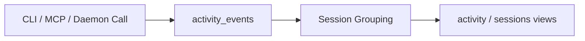

## Runtime / Process Model

Recall has 3 common runtime modes:

- one-shot CLI
- `launchd`-managed macOS daemon
- MCP stdio server

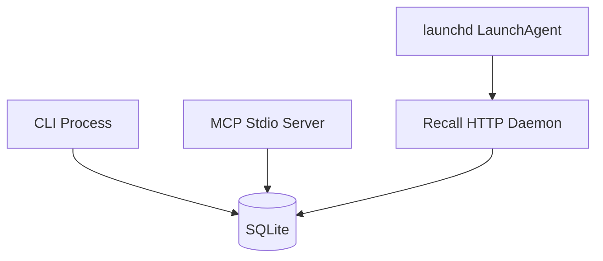

## Practical Summary

If you want to understand Recall quickly:

- scan and corrections create memories
- repo quality decides how strict promotion/injection should be
- compile turns active memories into a small pack
- MCP/daemon/export paths deliver that pack to agents
- activity log tells you what happened across sessions over time
