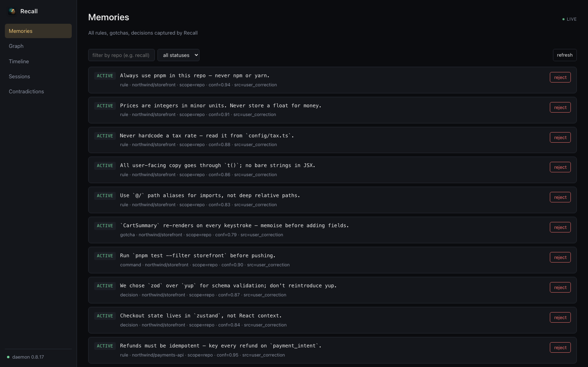
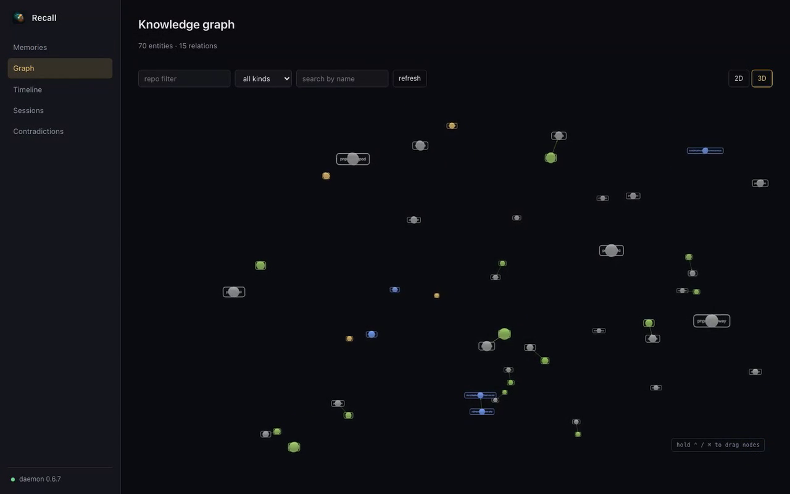
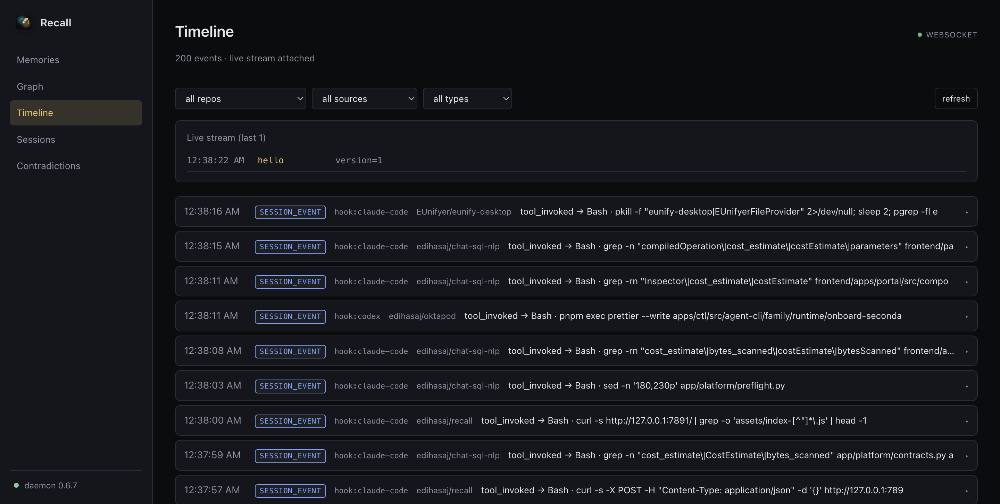
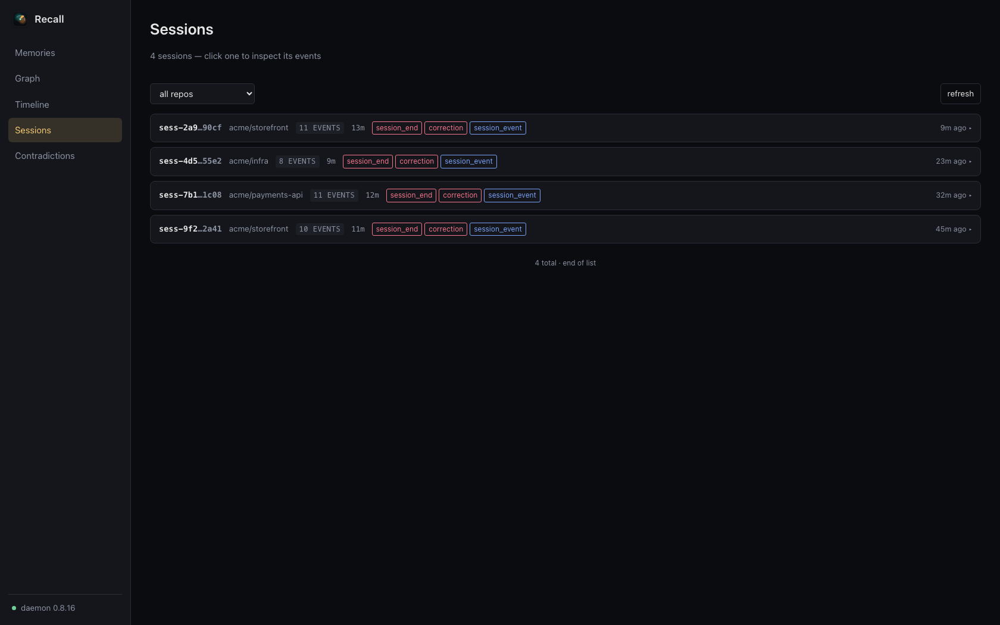

# Recall

Cross-tool coding memory + instruction compiler.

[](https://github.com/edihasaj/recall/actions/workflows/ci.yml)
[](https://github.com/edihasaj/recall/actions/workflows/release.yml)
[](https://github.com/edihasaj/recall/releases/latest)

Recall is a local repo-memory compiler for coding agents. It learns from corrections, review feedback, repo scans, and session outcomes, then injects compact trusted instructions through CLI, MCP, daemon endpoints, and lifecycle hooks.

- Website: <https://recallmemory.dev/>
- Releases: <https://github.com/edihasaj/recall/releases>
- Contributing: [CONTRIBUTING.md](CONTRIBUTING.md)
- Comparison vs other memory systems: [`benchmark/COMPARISON.md`](benchmark/COMPARISON.md)

## Why Recall?

You correct your agent. Next session it forgets. You correct it again. Recall captures the *durable rules* hidden in those corrections — once — and re-injects them every session via lifecycle hooks. Local-first, no cloud, no API keys required for the common path.

The story in 3 lines:

```bash
recall correct -r owner/repo "don't use npm, use pnpm"   # one correction
# next session start:
# → SessionStart hook fires, injects:  "- use pnpm as the package manager"
# → your agent never reaches for npm again
```

## Web Dashboard

The bundled web dashboard (open via the menu bar item *Open Dashboard in Browser*, or `recall webui start`) is the fastest way to see what Recall has learned: memories, the knowledge graph, recent activity, and live sessions across every agent that hits the daemon.



| Knowledge graph | Timeline | Sessions |
| --- | --- | --- |
|  |  |  |

- **Graph** — 2D layered view by entity kind plus a 3D force layout (toggle in the toolbar). Repo + kind dropdowns and a contains-match name search filter the visible set; click a node to drill into linked memories and neighbours.
- **Timeline** — filterable feed of every daemon event (compile, query, scan, correction, feedback, tool calls…). Click a row to expand the full request/result JSON; jump straight to the linked memories or pivot into the session view.
- **Sessions** — every distinct session Recall has seen across MCP, hooks, and CLI traffic, with duration, event count, and type breakdown. Expand a session to see its events inline or hand it off to the Timeline filtered by `session_id`.

## Benchmarks — Recall vs agentmemory

LongMemEval-S, N=500 non-abstention. Same dataset agentmemory publishes.

| System | R@5 | R@10 | R@20 | NDCG@10 | MRR |
|---|---|---|---|---|---|
| agentmemory BM25 + vector | 95.2 % | **98.6 %** | 99.4 % | 87.9 | **88.2** |
| Recall — same model (all-MiniLM-L6-v2) | **96.6 %** | 97.6 % | **99.8 %** | 87.0 | 86.8 |
| **Recall shipped (multilingual-e5-small)** | **97.4 %** | **99.4 %** | **99.6 %** | **90.1** | **89.5** |

The MiniLM row isolates the system contribution (same embedding model agentmemory uses); the e5 row is what Recall actually ships with. Full numbers, per-type breakdown, ablation, methodology → [`benchmark/COMPARISON.md`](benchmark/COMPARISON.md).

## Install

### Homebrew (macOS)

```bash
brew install --cask edihasaj/tap/recall
recall setup --yes
recall doctor
```

### Bash one-liner (macOS, Linux)

```bash
curl -fsSL https://recallmemory.dev/install.sh | bash
```

Runs `npm i -g @edihasaj/recall` + `recall setup --yes` for you, then prints next steps for the optional background service.

### npm (macOS, Linux)

```bash
npm i -g @edihasaj/recall
recall setup --yes
recall doctor
# Optional: run as a background service
recall daemon install            # launchd on macOS, systemd --user on Linux
```

On Linux, `recall daemon install` writes `~/.config/systemd/user/recall-daemon.service` and enables it. Logs: `journalctl --user -u recall-daemon`.

### PowerShell (Windows)

```powershell
irm https://recallmemory.dev/install.ps1 | iex
```

Installs the `@edihasaj/recall` CLI via npm, downloads the system-tray companion (`recall-tray-<arch>.exe`) into `%LOCALAPPDATA%\Programs\Recall`, registers a per-user Run-key entry for autostart, and launches the tray. Supports `arm64` and `amd64`. Logs land in `%LOCALAPPDATA%\Recall\`.

### GitHub Releases

Download `Recall.app.zip` from [the latest release](https://github.com/edihasaj/recall/releases/latest), unzip it, move `Recall.app` into `/Applications`, then run setup:

```bash
recall setup --yes
recall doctor
```

### Source

```bash
git clone https://github.com/edihasaj/recall.git
cd recall
nvm use
npm ci
npm run build
npm link
```

Source development expects Node 22, matching the bundled app runtime. If tests
fail with a `NODE_MODULE_VERSION` error from `better-sqlite3`, switch to Node
22 and reinstall dependencies so the native module ABI matches the test
runtime.

## Build macOS App From Source

Build the macOS app bundle:

```bash
npm run build:app
```

`scripts/build-app.sh` embeds Node 22. It prefers
`RECALL_NODE_PATH=/path/to/node` when set, otherwise the Node runtime from the
currently installed `/Applications/Recall.app`, then your shell `node`.

Install it into `/Applications`:

```bash
npm run install:app
```

The app embeds its own Node runtime plus Recall `dist/`, `drizzle/`, and `node_modules/`, then manages the bundled daemon via launchd.
When run from `/Applications`, the app registers itself as a login item by default so the menu bar status icon comes back after login; the daemon LaunchAgent remains the background worker.

Configure local agent runtimes against the installed app. `recall setup --yes` wires MCP and lifecycle hooks for supported detected runtimes so memory injection does not depend on the model choosing to call `query`:

```bash
recall setup --yes                       # shared MCP + hooks for detected runtimes
recall setup --scope project --yes       # add project-scoped hooks to the current repo
recall setup --uninstall-hooks --yes     # remove Recall-managed hooks
```

By default the hooks inject repo memory once at `SessionStart` (minimal format) and stay silent on every subsequent `UserPromptSubmit`. To re-enable per-prompt injection or wire provider credentials so the daemon can run memory maintenance on a schedule, see [docs/configuration.md](docs/configuration.md).

Supported runtimes, and how deep the integration goes:

| Runtime | Integration | Capture |
| --- | --- | --- |
| Claude Code | MCP + lifecycle hooks + managed `~/.claude/CLAUDE.md` block | automatic |
| Codex | MCP + `hooks.json` (legacy `notify` bridge below 0.115.0) | automatic |
| GitHub Copilot | MCP (`~/.copilot/mcp-config.json`) + `.github/copilot-instructions.md` | model-driven |
| opencode | MCP (`~/.config/opencode/opencode.json`) + `~/.config/opencode/AGENTS.md` | model-driven |
| Cursor | MCP (`~/.cursor/mcp.json`) + `.cursor/rules/recall.mdc` | model-driven |
| Windsurf | MCP (`~/.codeium/windsurf/mcp_config.json`) + global rules | model-driven |

Runtimes without a lifecycle-hook API can't be called on prompt/tool/session events, so Recall installs a managed rules block instructing the agent to call `capture_correction` and `query` itself. Capture there depends on the model following it — the hook-based runtimes do not.

Install + setup behavior:

- Routine app launch, daemon start, and daemon restart are non-mutating for agent integrations. They do not re-add hooks or repo instruction files after you remove them.
- Memory "rethinking": when provider credentials are stored, the daemon runs the dispatcher daily (tunable via `RECALL_DISPATCHER_INTERVAL_SECONDS`) to refine/merge/summarize memories. Use `recall maintenance credentials --help` for provider-specific fields. Observability: `recall maintenance usage`, `recall maintenance stats`. Without a key, pending tasks surface via SessionStart for the live agent to claim.
- `recall doctor` checks install state; `recall doctor --fix` or `recall setup --yes` wires MCP + hooks for supported agent runtimes.
- Repo-local `.recall/context.md` is an optional export/fallback, not the primary integration.

## First Run

Initialize DB:

```bash
recall init
```

Scan a real repo:

```bash
recall scan ~/Projects/some-repo
recall list
recall publish ~/Projects/some-repo
```

If an unseen repo is later queried through the daemon or MCP, Recall now tries a lazy one-time bootstrap by resolving the local clone and scanning just that repo.
Recall can also publish repo-local context into `.recall/context.md`; treat it as an optional export/fallback, not the primary agent integration.
Bootstrap now keeps operational commands hot and leaves softer scan facts as candidates or drops them during maintenance cleanup.

Inspect quality / health / injection pack:

```bash
recall quality -r owner/repo
recall health -r owner/repo
recall maintenance quality
recall eval value-retrieval --snapshot
recall maintenance quality --history
recall compile -r owner/repo
recall compile -r owner/repo --query "pytest -q" --include-candidates
```

Bootstrap local embeddings and the derived sqlite-vec index:

```bash
recall doctor
recall embeddings setup
recall embeddings info
recall embeddings bootstrap
recall embeddings verify
recall embeddings rebuild-index
recall search -r owner/repo "pnpm"
```

Optional embedding env vars:

```bash
RECALL_EMBEDDING_PROVIDER=multilingual-e5
RECALL_EMBEDDING_DIMS=384
RECALL_EMBEDDINGS_DISABLED=true
```

Upgrade note:

- First launch after the local-embeddings upgrade resets Recall's local DB.
- Recall rescans discovered repos and rebuilds embeddings/indexes in the background.
- Recall.app now surfaces that setup progress while the daemon comes up.

Daemon maintenance runs in-process on a timer.

Useful env vars:

```bash
RECALL_MAINTENANCE_INTERVAL_SECONDS=300
RECALL_ACTIVITY_RETENTION_DAYS=90
RECALL_FEEDBACK_RETENTION_DAYS=180
RECALL_SIGNAL_RETENTION_DAYS=180
RECALL_SQLITE_VACUUM_ENABLED=true
RECALL_SQLITE_VACUUM_MIN_FREE_PAGES=100
RECALL_SQLITE_VACUUM_MIN_FREE_RATIO=0.1
```

Inspect rolled-up session history:

```bash
recall history list -r owner/repo
recall history search -r owner/repo "pnpm"
```

Session history rolls up corrections, review feedback, compile observations,
and durable user decisions/directions from prompt activity.
Compiled context includes a small relevant history section so decisions can be
reused without promoting every prompt into a durable memory.
History injections are tracked separately from memory injections in
`recall maintenance quality`.

Run retrieval eval fixtures:

```bash
recall eval retrieval --file docs/retrieval-eval.example.json
recall eval retrieval --file docs/retrieval-eval.example.json --json
recall eval retrieval --file docs/retrieval-eval.recall.json
recall eval retrieval --file docs/retrieval-eval.recall-hybrid.json
```

## Teach It

Add a correction:

```bash
recall correct -r owner/repo "don't use npm, use pnpm"
recall list -r owner/repo
```

Confirm a memory manually:

```bash
recall confirm <memory-id>
```

Report review feedback:

```bash
recall review -r owner/repo "review said use error boundaries"
```

## Quality Model

`recall quality` shows:

- stage: `cold | growing | mature`
- quality score
- repeat sessions needed before promotion
- compile confidence threshold
- dedup similarity threshold

Behavior:

- cold repos learn faster
- mature repos need more repeat evidence
- noisy repos inject less aggressively

## Daemon

Start HTTP daemon:

```bash
node dist/daemon.js
```

Install as a user service (launchd on macOS, `systemd --user` on Linux; on Windows the tray app supervises the daemon — see the PowerShell installer above):

```bash
recall daemon install
recall daemon status
```

Useful service commands:

```bash
recall daemon start
recall daemon stop
recall daemon uninstall
```

Inspect hook telemetry:

```bash
recall hook stats
recall hook stats --agent codex
recall hook stats --json
```

Default URL:

```text
http://localhost:7890
```

Useful endpoints:

```bash
curl -s 'http://localhost:7890/quality?repo=owner/repo'
curl -s -X POST http://localhost:7890/compile \
  -H 'Content-Type: application/json' \
  -d '{"repo":"owner/repo"}'

curl -s -X POST http://localhost:7890/correct \
  -H 'Content-Type: application/json' \
  -d '{"repo":"owner/repo","session_id":"s1","text":"don'\''t use npm, use pnpm"}'
```

Session collector endpoints:

```bash
curl -s -X POST http://localhost:7890/session/start \
  -H 'Content-Type: application/json' \
  -d '{"session_id":"codex-1","client":"codex","repo_path":"'"$PWD"'"}'

curl -s -X POST http://localhost:7890/session/end \
  -H 'Content-Type: application/json' \
  -d '{"session_id":"codex-1","client":"codex","repo_path":"'"$PWD"'","payload":{"exit_code":0}}'
```

Optional repo-local context artifact:

```bash
recall publish .
cat .recall/context.md
```

## Claude Code MCP

Recall supports both MCP transports:

- stdio: Claude Code spawns Recall directly. This is the most portable default.
- HTTP: Claude Code connects to the daemon at `http://localhost:7890/mcp`.
  This requires the Recall app/daemon to be running.

Packaged macOS app, stdio config:

```json
{
  "mcpServers": {
    "recall": {
      "command": "/Applications/Recall.app/Contents/Resources/Runtime/bin/node",
      "args": ["/Applications/Recall.app/Contents/Resources/Runtime/dist/mcp.js"]
    }
  }
}
```

Source checkout, stdio config after `npm run build`:

```json
{
  "mcpServers": {
    "recall": {
      "command": "node",
      "args": ["/path/to/recall/dist/mcp.js"]
    }
  }
}
```

Daemon HTTP config:

```bash
claude mcp add --transport http -s user recall http://localhost:7890/mcp
```

Equivalent JSON:

```json
{
  "mcpServers": {
    "recall": {
      "type": "http",
      "url": "http://localhost:7890/mcp"
    }
  }
}
```

The rest of the daemon API remains available on the same port, for example
`/health`, `/compile`, and `/session/start`.

Useful MCP tools:

- `query`
- `report_correction`
- `capture_correction`
- `report_review`
- `signal_outcome`
- `session_end`
- `quality`
- `list`
- `confirm`

## Session Wrappers

Use the thin wrappers in `scripts/` if you want Recall to auto-learn from session starts before retrieval is useful:

```bash
scripts/recall-codex
scripts/recall-claude
```

They:

- send `/session/start` with the current git root or `pwd`
- let the real client run normally
- send `/session/end` with the final exit code

Override targets if needed:

```bash
RECALL_CODEX_BIN=/path/to/codex scripts/recall-codex
RECALL_CLAUDE_BIN=/path/to/claude scripts/recall-claude
RECALL_DAEMON_URL=http://localhost:7890 scripts/recall-codex
```

## MCP First

Recommended production pattern:

- run Recall locally via `/Applications/Recall.app`
- let agents query/live-report through Recall MCP
- treat `.recall/context.md` as optional export/fallback, not the primary path

## Fast Test Loop

```bash
recall init
recall scan ~/Projects/some-real-repo
recall quality -r owner/repo
recall compile -r owner/repo
recall correct -r owner/repo "don't use npm, use pnpm"
recall list -r owner/repo
```

If you want repeated-session promotion testing, use the daemon `/correct` endpoint with different `session_id` values.

## Development

```bash
npm ci
npm run docs:check
npm run typecheck
npm test
npm run build
```

Release and Homebrew publishing notes live in [docs/RELEASING.md](docs/RELEASING.md). The landing page is static HTML/CSS in [docs/](docs/) and deploys with GitHub Pages.
